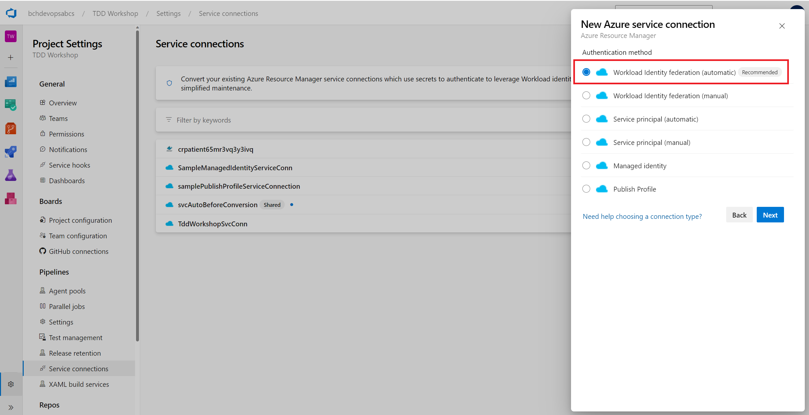
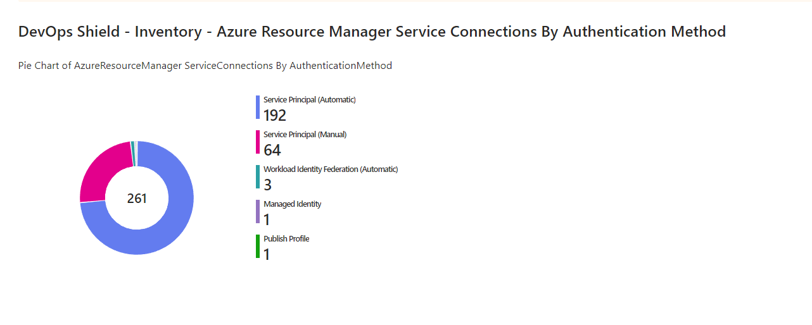
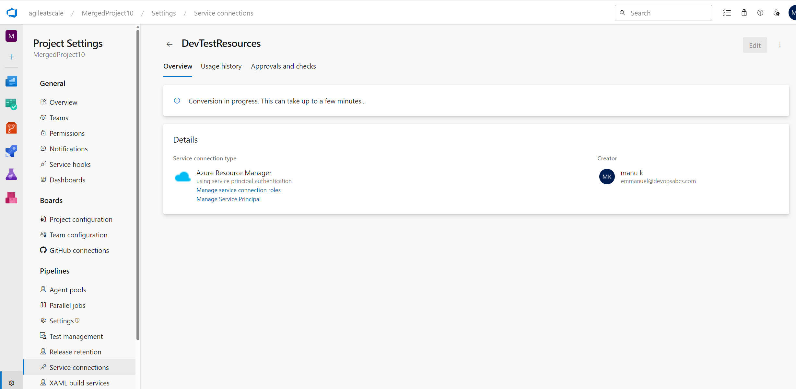
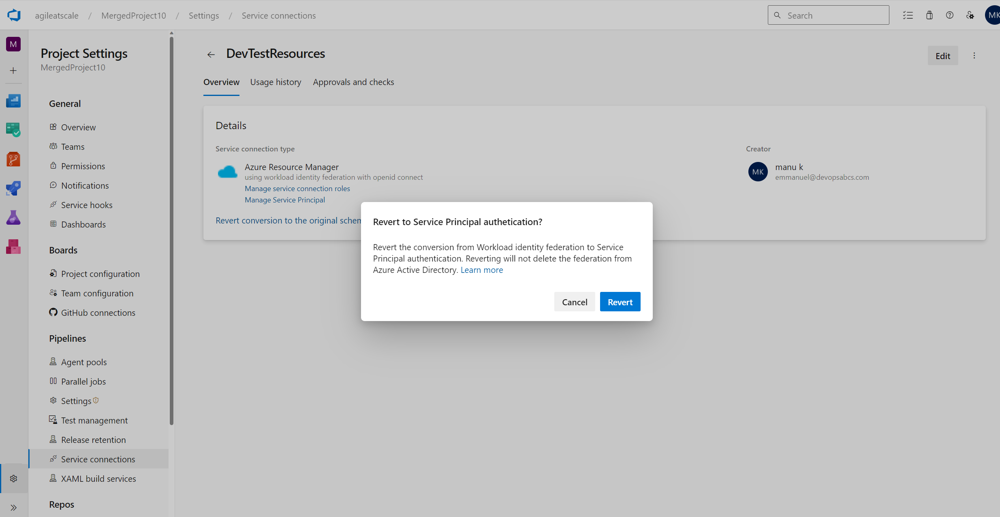
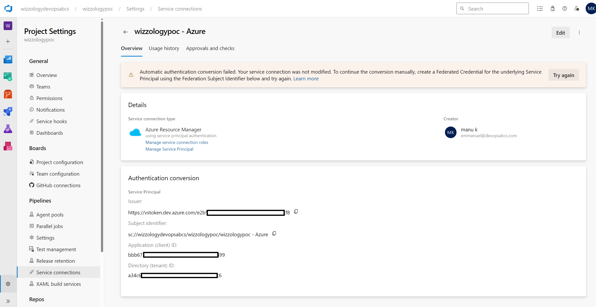
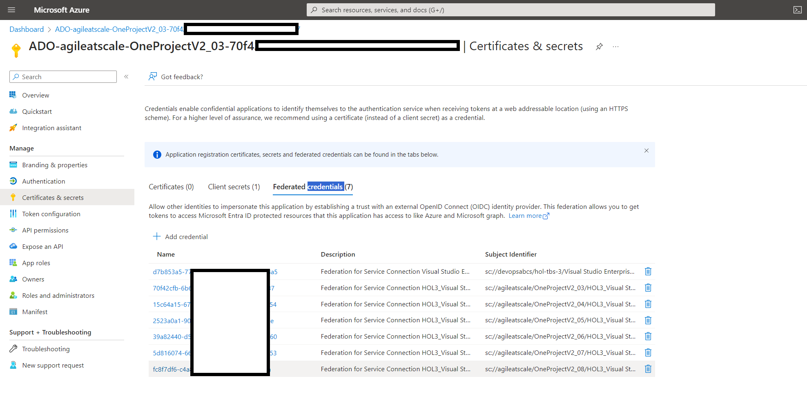
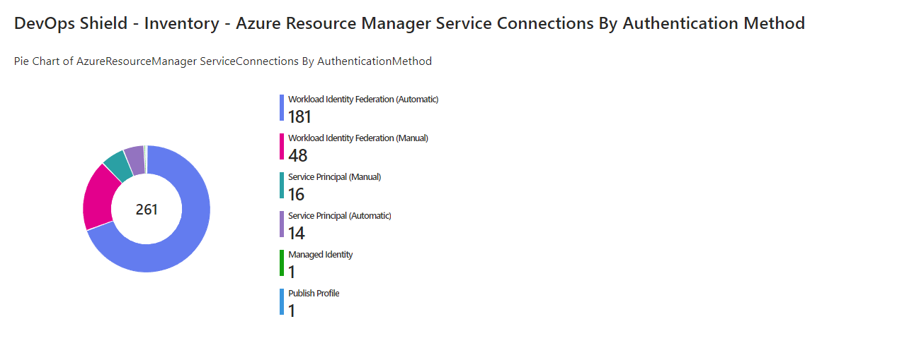

# Azure DevOps Workload Identity Federation

## Updating your Azure DevOps ARM Service Connections to use the recommended Workload Identity Federation

With the recent arrival of the [Public preview of Workload identity federation for Azure Pipelines](https://devblogs.microsoft.com/devops/public-preview-of-workload-identity-federation-for-azure-pipelines/), you may be wondering how can I efficiently migrate my dozens or even hundreds of ARM Service Connections to take advantage of these main benefits:
- **Simplified management**: You do not need to generate, copy, and store secrets from service principals in Azure Entra ID to Azure DevOps anymore. Secrets that are used in other authentication schemes of Azure service connections (e.g., service principal) expire after a certain period (2 years currently). When they expire, pipelines fail. You have to generate a new secret and update the service connection. Switching to workload identity federation eliminates the need to manage these secrets and improves the overall experience of creating and managing service connections.
- **Improved security**: With workload identity federation, the federation subject `sc://<org>/<project>/<service connection name>` uniquely identifies what the identity can be used for, which provides a better constraint than a (shared) secret. There is no persistent secret involved in the communication between Azure Pipelines and Azure. As a result, tasks running in pipeline jobs cannot leak or exfiltrate secrets that have access to your production environments. This has often been a concern for our customers.




## Before the conversion

First, you will need an inventory of all your Azure DevOps ARM Service Connections which you can do in one of two ways:
1. Following the steps outlined in [Getting All ADO Service Connections (Do-It-Yourself)](https://github.com/devopsshield/azure-devops-service-connection#getting-all-ado-service-connections-do-it-yourself)
1. Simply leveraging DevOps Shield as in [Getting All ADO Service Connections (With DevOps Shield)](https://github.com/devopsshield/azure-devops-service-connection#getting-all-ado-service-connections-with-devops-shield)

DevOps Shield is an innovative cybersecurity platform for DevOps and available for FREE from the [Azure Marketplace](https://azuremarketplace.microsoft.com/en-us/marketplace/apps/cad4devopsinc1662079207461.devops-shield?src=website&mktcmpid=header). It continuously provides a full inventory of all our ADO resources including all service connections.

We opted for the second method as we automatically and continuously get the full inventory of all Service Connections in all projects of all our organizations. In addition, there's a handy inventory workbook that gives us a pie chart of all the ARM Service Connections by Authentication Method:



The Kusto Query we used to retrieve all our service connections is [service-connections.kql](queries/service-connections.kql).

## Converting Authentication Scheme from Service Principal to Workload Identity Federation

The bulk conversion is done via the script [Convert-ServicePrincipals.ps1](scripts/Convert-ServicePrincipals.ps1).

It relies on a (yet) *undocumented* PUT call:
```
PUT https://dev.azure.com/${organizationName}/_apis/serviceendpoint/endpoints/${endpointId}?operation=ConvertAuthenticationScheme&api-version=${apiVersion}
```
with payload
```
{
    "id": "${endpointId}",
    "type": "azurerm",
    "authorization": {
        "scheme": "WorkloadIdentityFederation"
    },
    "serviceEndpointProjectReferences": [
        {
            "description": "",
            "name": "${serviceConnectionName}",
            "projectReference": {
                "id": "${projectId}",
                "name": "${projectName}"
            }
        }
    ]
}
```
Whether you convert the service connection in the Azure DevOps UI or programmatically via the PUT call above, you should see a screen similar to:


## Reverting a conversion

You have 7 days to revert back to a service principal. The same PUT call will work after simply changing the payload's `authorization.scheme` from `WorkloadIdentityFederation` to `ServicePrincipal`.
Reverting looks like this in the Azure DevOps portal:


## Handling Manual Conversions

1. When handling manual conversions through the API, you may see an error such as:
```
{
	"$id": "1",
	"innerException": null,
	"message": "The authorization scheme could not be upgraded to WorkloadIdentityFederation because the service principal could not be configured automatically, and no valid configuration exists.",
	"typeName": "System.ArgumentException, mscorlib",
	"typeKey": "ArgumentException",
	"errorCode": 0,
	"eventId": 0
}
```
Or in the Azure DevOps Portal, you may see the following message:
```
Automatic authentication conversion failed. Your service connection was not modified. To continue the conversion manually, create a Federated Credential for the underlying Service
Principal using the Federation Subject Identifier below and try again.
```
as in this screenshot:

1. To create a federated credential, first create a file called credential.json which follows this template:
```
{
    "name": "__ENDPOINT_ID__",
    "issuer": "https://vstoken.dev.azure.com/__ORGANIZATION_ID__",
    "subject": "sc://__ORGANIZATION_NAME__/__PROJECT_NAME__/__SERVICE_CONNECTION_NAME__",
    "description": "Federation for Service Connection __SERVICE_CONNECTION_NAME__ in https://dev.azure.com/__ORGANIZATION_NAME__/__PROJECT_NAME__/_settings/adminservices?resourceId=__ENDPOINT_ID__",
    "audiences": [
        "api://AzureADTokenExchange"
    ]
}
```
1. Then use the az cli with the application registration id (aka Client Id) `$appObjectId` as such:
```
az ad app federated-credential create --id $appObjectId --parameters credential.json
```
Bear in mind that the script [Convert-ServicePrincipals.ps1](scripts/Convert-ServicePrincipals.ps1) automatically handles this case and will pre-create the necessary federated credentials prior to attempting a conversion for a manual Service Principal.

## Conversion of manual service principals referenced by multiple service connections

As mentioned in [Establishing order through naming conventions](https://github.com/devopsshield/azure-devops-service-connection#establishing-order-through-naming-conventions), it is not recommended to have a single app registration referenced by multiple service connections. However, the script will convert the multiple service connections leveraging multiple federated credentials such as:


## Common errors while attempting to convert

1. While running the conversion script, you may see the following error:
```
{
	"$id": "1",
	"innerException": null,
	"message": "Converting endpoint type azurerm scheme from WorkloadIdentityFederation to WorkloadIdentityFederation is neither an upgrade or a downgrade and is not supported.",
	"typeName": "System.ArgumentException, mscorlib",
	"typeKey": "ArgumentException",
	"errorCode": 0,
	"eventId": 0
}
```
This indicates that you are trying to convert to the same authorization scheme, in the above case: WorkloadIdentityFederation.
1. If you are using [Azure Stack](https://azure.microsoft.com/en-us/products/azure-stack/), you may encounter the following Azure Stack related error:
```
{
	"$id": "1",
	"innerException": null,
	"message": "Unable to connect to the Azure Stack environment. Ignore the failure if the source is Azure DevOps.",
	"typeName": "Microsoft.VisualStudio.Services.ServiceEndpoints.WebApi.ServiceEndpointException, Microsoft.VisualStudio.Services.ServiceEndpoints.WebApi",
	"typeKey": "ServiceEndpointException",
	"errorCode": 0,
	"eventId": 3000
}
```
You may ignore this as Azure Stack is not supported (see [Create an Azure Resource Manager service connection using workload identity federation
](https://learn.microsoft.com/en-us/azure/devops/pipelines/library/connect-to-azure?view=azure-devops#create-an-azure-resource-manager-service-connection-using-workload-identity-federation)).

## After Conversion

1. A sample production run
```
./Convert-ServicePrincipals.ps1 -WorkspaceName 'log-devopsshield-ek010devfd63l2gacbtca' `
     -ResourceGroupName  'rg-devopsshieldek010dev' `
     -subscriptionIdOrName "Microsoft Azure Sponsorship" `
     -isProductionRun $true `
     -skipPauseAfterError $true `
     -skipPauseAfterWarning $true
```
generates a summary such as:

1. You may need to iterate a few times. Don't worry, the script is idempotent. Eventually, we got:

This is great as we have managed to convert a large majority of our service connections automatically thus saving us lots of time!

# References

- [Public preview of Workload identity federation for Azure Pipelines](https://devblogs.microsoft.com/devops/public-preview-of-workload-identity-federation-for-azure-pipelines/)
- [Convert an existing ARM service connection to use workload identity federation](https://learn.microsoft.com/en-us/azure/devops/pipelines/library/connect-to-azure?view=azure-devops#convert-an-existing-arm-service-connection-to-use-workflow-identity-federation)
- [Get started with Azure DevOps CLI](https://learn.microsoft.com/en-us/azure/devops/cli/?view=azure-devops)
- [DevOps Shield - Azure Marketplace](https://azuremarketplace.microsoft.com/en-us/marketplace/apps/cad4devopsinc1662079207461.devops-shield?src=website&mktcmpid=header)
- [DevOps Shield](https://www.devopsshield.com)
